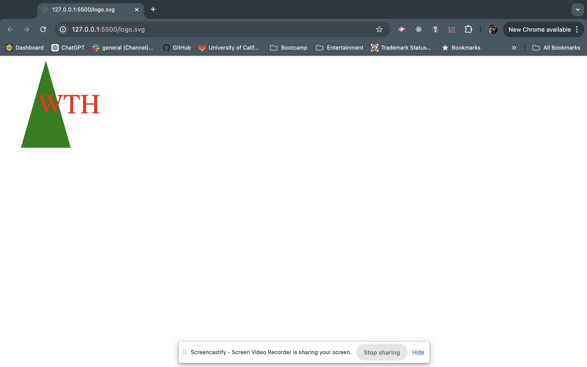

# SVG LogoMaker 10

## Description
The SVG Logo Maker is a command-line application built with Node.js that generates a simple logo in SVG format via user questions. Users can create logos using text, shape and colors. The logo is the saved as an SVG file.

This application using OOP principles and includes tests with Jest.

## Table of Contents

- [Description](#description)
- [Features](#features)
- [Installation](#installation)
- [Usage](#Usage)
- [Tests](#tests)
- [Example](#examples)
- [Technology](#technology)
- [License](#license)
- [Contributing](#contributing)

## Features
- Generates SVG logos from user input
- Supports Circle, Square and Triangle Shapes 

## Installation 

Repo: 
[LogoMakerRepoLink](https://github.com/kobESB6/LogoMaker)

Video:
[Submission Video](https://app.screencastify.com/v3/watch/tgSWVtCCPl3YxexHvOh7)

#### Install Dependecies:

cd Logo Maker

## Usage 
Run the application
node index.js

Follow Prompts to create the logo 

The created logo will be save as an svg file

## Tests
Run the tests using Jest:
npm test 

## Examples 

## Technology Used
- Node.js
- Inquirer.js
- Jest

## License

This Project is Licensed under the MIT License

## Contibuting 

Contributions are welcome.. Please open an issue or submit a pull request 

